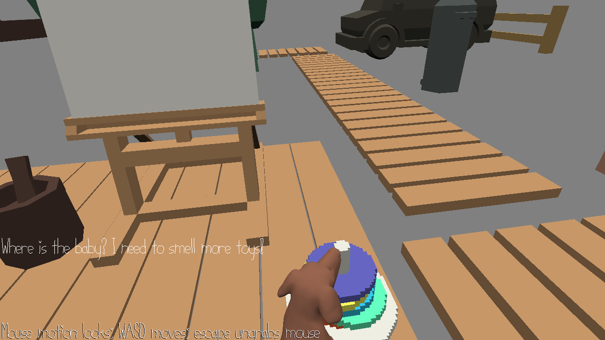

# Babysmeller

Author: Qingyi Dong, Michelle Chang

Design: A treasure hunting type game where you are a dog trying to find a baby.

Screen Shot:

How To Play:

You are a dog living in a magnificent house. The owners have gave you the mission to babysit their baby while they are 
away, but you need to find the baby first. Gather clues by smelling the baby's favorite toys.  
- WASD to move
- Drag to look
- space to smell an object

Sources:  
Voxel assets created with [MagicaVoxel](https://ephtracy.github.io/)  
Dog model found [here](https://free3d.com/3d-model/farm-dog-v2--499533.html). It has a license for personal use.  
Baby model found [here](https://free3d.com/3d-model/crawlingbaby-v1--407140.html). It also has a license for personal use.  
Scene model sources [here](https://sketchfab.com/3d-models/art-room-0dd281b876ca44469109a2ccbf35ac5c), [here](https://kenney.nl/assets/nature-kit) and [here](https://kenney.nl/assets/furniture-kit). They both have licenses for personal use.  

This game was built with [NEST](NEST.md).

